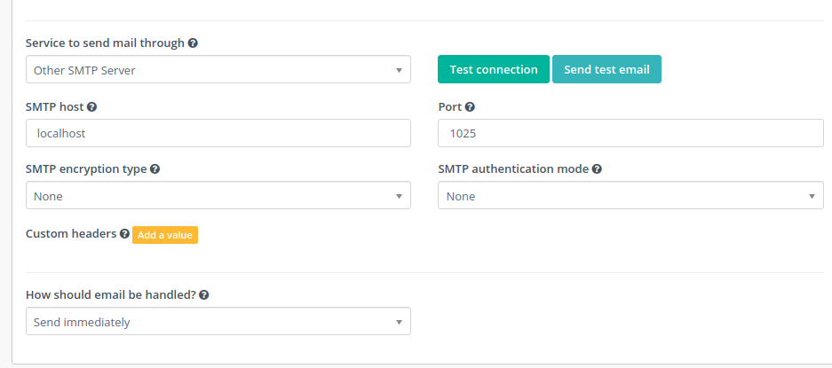

Emails
######

There are multiple ways to extend the way Mautic works with Emails. This document describes the following options for extending Mautic's Email capabilities:

- Email tokens
- A/B testing
- Monitored Inbox Integration
- Email transport/Email providers
- Email stat helpers

.. Note:: Extending generally works by hooking into events using event listeners or subscribers. Read more about :doc:`listeners and subscribers</plugins/event_listeners>`.

Email tokens
------------

Email tokens are placeholders that you can insert into an Email.
They get replaced by Dynamic Content once the Email gets sent or viewed in the browser.

Email token capabilities consist of two parts: registering your custom tokens and rendering them.

Registering custom tokens in builders
^^^^^^^^^^^^^^^^^^^^^^^^^^^^^^^^^^^^^

Registering tokens leverages the ``\Mautic\EmailBundle\EmailEvents::EMAIL_ON_BUILD`` event.
The event is dispatched before displaying the email builder form, to allow adding of tokens.

An event listener receives the ``Mautic\EmailBundle\Event\EmailBuilderEvent``.
Use its ``$event->addToken($token, $htmlContent)`` to add your token.

.. Note:: You can either hard code your tokens textual description in ``$htmlContent`` or use a translatable string.

Rendering custom tokens
^^^^^^^^^^^^^^^^^^^^^^^

Registering tokens leverage the
- ``\Mautic\EmailBundle\EmailEvents::EMAIL_ON_SEND`` event when the email is sent or the
- ``\Mautic\EmailBundle\EmailEvents::EMAIL_ON_SEND`` event when the email is rendered for viewing in a browser, i.e., after the Lead clicked the ``{webview_url}`` link.

An event listener receives in both cases the ``Mautic\EmailBundle\Event\EmailSendEvent``.
Replacing a custom token is as easy as using the events ``$event->addToken($token, $contentToReplaceToken)``.

Example
^^^^^^^

.. code-block:: PHP

    <?php
    
    // plugins/HelloWorldBundle/EventListener/EmailSubscriber.php
    class EmailSubscriber implements EventSubscriberInterface
    {
    
      public static function getSubscribedEvents(): array
      {
        return [
          EmailEvents::EMAIL_ON_BUILD => ['onEmailBuild', 0],
          EmailEvents::EMAIL_ON_SEND => ['onEmailGenerate', 0],
          EmailEvents::EMAIL_ON_DISPLAY => ['onEmailGenerate', 0],
        ];
      }
    
      public function onEmailBuild(EmailBuilderEvent $event): void
      {
        $event->addToken('{my_custom_token}', 'My Custom Token');
      }
    
      public function onEmailGenerate(EmailSendEvent $event): void
      {
        $event->addToken('{my_custom_token}', 'Hello <b>World!</b>');
      }
    }

.. Note:: If you need more complex replacing you can use the event's ``$event->getContent()`` and ``$event->setContent()`` methods. See the example in the following section.

Email A/B testing
-----------------

While Mautic supports :xref:`A/B testing` out of the box, you might have more complex needs to determine A/B test winner criteria.

- ``$event->addAbTestWinnerCriteria()`` allows you to do exactly that. Using your custom logic, you can decide the winner of such criteria. An example is shown below.
- ``$event->setAbTestResults()`` is where you set the actual A/B test results. More details are in the code example below.

Example
^^^^^^^

.. code-block:: PHP

    <?php
    // plugins/HelloWorldBundle/EventListener/EmailSubscriber.php

    declare(strict_types=1);

    namespace MauticPlugin\HelloWorldBundle\EventListener;

    use Mautic\CoreBundle\Helper\TemplatingHelper;
    use Mautic\EmailBundle\EmailEvents;
    use Mautic\EmailBundle\Event\EmailBuilderEvent;
    use Mautic\EmailBundle\Event\EmailSendEvent;
    use MauticPlugin\HelloWorldBundle\HelloWorldEvents;
    use Symfony\Component\EventDispatcher\EventSubscriberInterface;

    final class EmailSubscriber implements EventSubscriberInterface
    {
        private TemplatingHelper $templating;

        public function __construct(TemplatingHelper $templating)
        {
            $this->templating = $templating;
        }

        public static function getSubscribedEvents(): array
        {
            return [
                EmailEvents::EMAIL_ON_BUILD   => ['onEmailBuild', 0],
                EmailEvents::EMAIL_ON_SEND    => ['onEmailGenerate', 0],
                EmailEvents::EMAIL_ON_DISPLAY => ['onEmailGenerate', 0],
            ];
        }

        /**
        * Register the token and a custom A/B test winner
        */
        public function onEmailBuild(EmailBuilderEvent $event): void
        {
            // Displays the token in the email builder, so that users can easily find it and add it to their emails
            $event->addToken('helloworld.token', 'Hello world token');

            // Add AB Test Winner Criteria
            $event->addAbTestWinnerCriteria(
                'helloworld.planetvisits',
                [
                    // Label to group by
                    'group' => 'plugin.helloworld.header',
                    
                    // Label for this specific a/b test winning criteria
                    'label' => 'plugin.helloworld.emailtokens.',

                    // Event that will be used to determine the winner
                    'event' => HelloWorldEvents::ON_DETERMINE_PLANET_VISIT_WINNER
                ]
            );
        }

        /**
        * Search and replace tokens with content
        */
        public function onEmailGenerate(EmailSendEvent $event): void
        {
            // Get content
            $content = $event->getContent();

            // Search and replace tokens
            $content = str_replace(
                '{helloworld.token}',
                $this->templating->getTemplating()->render('HelloWorldBundle:SubscribedEvents\EmailToken:token.html.php'),
                $content
            );

            // Set updated content
            $event->setContent($content);
        }
    }

.. code-block:: PHP

    <?php
    // plugins/HelloWorldBundle/EventListener/PlanetVisitSubscriber.php

    declare(strict_types=1);

    namespace MauticPlugin\HelloWorldBundle\EventListener;

    use Mautic\CoreBundle\Event\DetermineWinnerEvent;
    use MauticPlugin\HelloWorldBundle\HelloWorldEvents;
    use Symfony\Component\EventDispatcher\EventSubscriberInterface;

    final class PlanetVisitSubscriber implements EventSubscriberInterface
    {
        public static function getSubscribedEvents(): array
        {
            return [
                HelloWorldEvents::ON_DETERMINE_PLANET_VISIT_WINNER   => ['onDeterminePlanetVisitWinner', 0],
            ];
        }

        public function onDeterminePlanetVisitWinner(DetermineWinnerEvent $event): void
        {
            $event->setAbTestResults([
                'winners' => [],
                'support' => [
                    'labels' => ['label1', 'label2'],
                    'data'   => [
                        'label1' => [100,200],
                        'label2' => [200,300]
                    ],
                    'step_width' => 10
                ],
                'supportTemplate' => 'HelloWorldBundle:SubscribedEvents\AbTest:bargraph.html.php'
            ]);
        }
    }

.. code-block:: PHP

    <?php
    // plugins/HelloWorldBundle/Views/SubscribedEvents/AbTest/bargraph.html.php

    declare(strict_types=1);

    $support = $results['support'];
    $label   = 'My chart label';
    $chart   = new \Mautic\CoreBundle\Helper\Chart\BarChart($support['labels']);

    if ($support['data']) {
        foreach ($support['data'] as $datasetLabel => $values) {
            $chart->setDataset($datasetLabel, $values);
        }
    }
    ?>

    

        

            

                <h5 class="text-white dark-md fw-sb mb-xs">
                    <?php echo $label; ?>
                </h5>
            

            

                <h3 class="text-white dark-sm"></h3>
            

        

        <?php echo $view->render(
            'MauticCoreBundle:Helper:chart.html.php',
            ['chartData' => $chart->render(), 'chartType' => 'bar', 'chartHeight' => 300]
        ); ?>
    

.. vale off

Monitored Inbox Integration
---------------------------

.. vale on

Plugins have access to hook into the ``mautic:email:fetch`` command to fetch email from a specific inbox/folder and process the content of the message.
The Plugin also has access to inject specific search criteria for the processed messages.

To do this, the Plugin needs to add an event listener for three events:

1. ``EmailEvents::MONITORED_EMAIL_CONFIG`` This event is dispatched to inject the fields into Mautic's Configuration to configure the IMAP inbox and folder that should be monitored.
2. ``EmailEvents::EMAIL_PRE_FETCH`` This event is dispatched during the execution of the ``mautic:email:fetch`` command. It's used to inject search criteria for the messages desired.
3. ``EmailEvents::EMAIL_PARSE`` This event parses the messages fetched by the command.

.. code-block:: PHP

    <?php
    // plugins/HelloWorldBundle/EventListener/MonitoredInboxSubscriber.php

    declare(strict_types=1);

    namespace MauticPlugin\HelloWorldBundle\EventListener;

    use Mautic\EmailBundle\EmailEvents;
    use Mautic\EmailBundle\Event\MonitoredEmailEvent;
    use Mautic\EmailBundle\Event\ParseEmailEvent;
    use Mautic\EmailBundle\MonitoredEmail\Mailbox;
    use Symfony\Component\EventDispatcher\EventSubscriberInterface;

    final class MonitoredInboxSubscriber implements EventSubscriberInterface
    {
        private $bundle = 'HelloWorldBundle';
        private $monitor =  'deep_space_emails';

        static public function getSubscribedEvents(): array
        {
            return [
                EmailEvents::MONITORED_EMAIL_CONFIG => ['onConfig', 0],
                EmailEvents::EMAIL_PRE_FETCH        => ['onPreFetch', 0],
                EmailEvents::EMAIL_PARSE            => ['onParse', 0],
            ];
        }

        /**
        * Inject the IMAP folder settings into the Configuration
        */
        public function onConfig(MonitoredEmailEvent $event): void
        {
            /**
            * The first argument is something unique to recognize this plugin.
            * The second argument should be something unique to identify this monitored inbox.
            * The third argument is the label for this monitored inbox.
            */
            $event->addFolder($this->bundle, $this->monitor, 'mautic.world.monitored_deep_space_emails');
        }

        /**
        * Inject search criteria for which messages to fetch from the configured folder.
        */
        public function onPreFetch(ParseEmailEvent $event): void
        {
            $event->setCriteriaRequest($this->bundle, $this->monitor, Mailbox::CRITERIA_UNSEEN. " " . Mailbox::CRITERIA_FROM ." aliens@andromeda");
        }

        /**
        * Parse the messages
        */
        public function onParse(ParseEmailEvent $event): void
        {
            if ($event->isApplicable($this->bundle, $this->monitor)) {
                $messages = $event->getMessages();

                foreach ($messages as $message) {
                    // Do something
                }
            }
        }
    }

Email transports
----------------

Mautic supports quite some Email providers out of the box (Amazon Simple Email Service, SendGrid, etc.).
If you want to add your own Email transport, that's certainly possible.

The most important thing here is to create a service that's tagged as ``mautic.email.transport_type``, so that Mautic recognizes it as a transport type.

.. code-block:: PHP

    <?php
    // plugins/HelloWorldBundle/Config/config.php

    declare(strict_types=1);

    return [
        
        ...

        'services'    => [
            
            ...

            'other' => [
                'mautic.transport.helloworld_api' => [
                    'class'        => \MauticPlugin\HelloWorldBundle\Swiftmailer\Transport\HelloWorldApiTransport::class,
                    'serviceAlias' => 'swiftmailer.mailer.transport.%s',
                    'arguments'    => [
                        'mautic.helper.core_parameters',
                    ],
                    'tag'          => 'mautic.email_transport',
                    'tagArguments' => [
                        # Translatable alias that is used as an internal key for the transport type, but also as the translation key.
                        \Mautic\EmailBundle\Model\TransportType::TRANSPORT_ALIAS => 'mautic.email.config.mailer_transport.helloworld_api',
                        # Determines which fields to show in Mautic's configuration screen (under Email Settings)
                        \Mautic\EmailBundle\Model\TransportType::FIELD_HOST      => true,
                        \Mautic\EmailBundle\Model\TransportType::FIELD_API_KEY   => true,
                        \Mautic\EmailBundle\Model\TransportType::FIELD_PASSWORD  => true,
                        \Mautic\EmailBundle\Model\TransportType::FIELD_PORT      => true,
                        \Mautic\EmailBundle\Model\TransportType::FIELD_USER      => true
                    ],
                ],
            ],
        ],
    ];

The actual implementation of the service would then look something like this:

.. code-block:: PHP

    <?php
    // plugin/HelloWorldBundle/Swiftmailer/Transport/HelloeWorldApiTransport.php

    declare(strict_types=1);

    namespace MauticPlugin\HelloWorldBundle\Swiftmailer\Transport;

    use Mautic\CoreBundle\Helper\CoreParametersHelper;
    use Mautic\EmailBundle\Swiftmailer\Transport\AbstractTokenArrayTransport;
    use Mautic\EmailBundle\Swiftmailer\Transport\CallbackTransportInterface;
    use Symfony\Component\HttpFoundation\Request;

    class HelloWorldApiTransport extends AbstractTokenArrayTransport implements \Swift_Transport, CallbackTransportInterface
    {
        private CoreParametersHelper $coreParametersHelper;

        public function __construct(CoreParametersHelper $coreParametersHelper)
        {
            $this->coreParametersHelper = $coreParametersHelper;
        }

        /**
        * @return int
        *
        * @throws \Exception
        */
        public function send(\Swift_Mime_SimpleMessage $message, &$failedRecipients = null)
        {
            $count            = 0;
            $failedRecipients = (array) $failedRecipients;

            if ($event = $this->getDispatcher()->createSendEvent($this, $message)) {
                $this->getDispatcher()->dispatchEvent($event, 'beforeSendPerformed');
                if ($event->bubbleCancelled()) {
                    return 0;
                }
            }

            try {
                // The message object contains all the email details (from/to/body/etc.)
                $from = $message->getFrom();
                $to   = $message->getTo();
                $body = $message->getBody();

                // Configuration values that were set by the user through Mautic's Configuration screen
                $host   = $this->coreParametersHelper->get('mautic.mailer_host');
                $apiKey = $this->coreParametersHelper->get('mautic.mailer_api_key');

                // Do your magic for sending the email here
                // $myService->send(...)

                // Return the number of recipients who were accepted for delivery
                return 1;
            } catch (\Exception $e) {
                $this->triggerSendError($event, $failedRecipients);
                $message->generateId();
                $this->throwException($e->getMessage());
            }

            // Return the number of recipients who were accepted for delivery
            return 0;
        }

        /**
        * @inheritdoc
        */
        public function getMaxBatchLimit(): int
        {
            return 50;
        }

        /**
        * @inheritdoc
        */
        public function getBatchRecipientCount(\Swift_Message $message, $toBeAdded = 1, $type = 'to'): int
        {
            $toCount  = is_array($message->getTo()) ? count($message->getTo()) : 0;
            $ccCount  = is_array($message->getCc()) ? count($message->getCc()) : 0;
            $bccCount = is_array($message->getBcc()) ? count($message->getBcc()) : 0;

            return null === $this->batchRecipientCount ? $this->batchRecipientCount : $toCount + $ccCount + $bccCount + $toBeAdded;
        }

        /**
        * @inheritdoc
        */
        public function getCallbackPath(): string
        {
            return 'helloworld_api';
        }

        /**
        * @inheritdoc
        */
        public function processCallbackRequest(Request $request)
        {
            $postData = json_decode($request->getContent(), true);

            // Handle the callback here
        }

        private function triggerSendError(\Swift_Events_SendEvent $evt, array &$failedRecipients): void
        {
            $failedRecipients = array_merge(
                $failedRecipients,
                array_keys((array) $this->message->getTo()),
                array_keys((array) $this->message->getCc()),
                array_keys((array) $this->message->getBcc())
            );

            if ($evt) {
                $evt->setResult(\Swift_Events_SendEvent::RESULT_FAILED);
                $evt->setFailedRecipients($failedRecipients);
                $this->getDispatcher()->dispatchEvent($evt, 'sendPerformed');
            }
        }
    }

Email stat helpers
------------------

This section is in progress. See  ``\Mautic\EmailBundle\Stats\Helper\StatHelperInterface``

.. vale off

Testing Email transports
************************

.. vale on
  
This document targets software developers who write Email transports based on ``Symfony Mailer`` which is available to Mautic from Mautic 5.0.  
  
This document describes Manual steps for testing and the items that you need to verify before submitting your PR for approval in case you want to add a new transport.  
  
Email components
****************

Each Email sent out by Mautic includes the following components:  
  
#. **Email Address:** (``FROM``, ``TO``, ``CC``, ``BCC``, ``REPLY-TO``): ``Unicode`` Email address in this format ``email@example.com`` or ``email+test@example.com``. Make sure that you always use the Unicode email address to accommodate special characters in languages like Arabic, Hebrew, or Chinese.  
#. **Email Name:** (``FROM``, ``TO``, ``CC``, ``BCC``, ``REPLY-TO``): ``Unicode`` Human-readable name, make sure that you always use Unicode Email address to accommodate special characters in languages like Arabic, Hebrew, or Chinese.  
#. **Subject:** ``Unicode`` string that might include emojis.  
#. **Text:** ``Unicode`` string that might include emojis.  
#. **HTML:** ``Unicode`` string that might include emojis, in HTML format.  
#. **Headers:** ``ANSI`` string pairs, ``Symfony/Mailer`` adds most of the headers, but for some transports, you need to add your own headers, so you can use the methods mentioned here: https://symfony.com/doc/current/mailer.html#message-headers, referenced in this file https://github.com/symfony/symfony/blob/HEAD/src/Symfony/Component/Mime/Header/Headers.php. 
#. **Priority:** sets the Email priority based on ``enum``
#. **Attachments:** a file with a variety of mime types, the file size shouldn't exceed a specific size provided by the transport provider, usually nothing more than 10 MB and go up to 40 MB (for the whole message, including the text, HTML, and anything embedded within the HTML)  
  
Preparing Mautic for testing
****************************

#. Create 10 Contacts with any Email address you need  
#. Create a Segment that includes the 10 Contacts  

.. vale off

Testing Email transport
***********************

.. vale on

In order to test the Email transport you need to go through the following steps:  
  
Testing the connection
======================

Go to Mautic Configuration -> Email Settings -> Click on Test Connection. If the connection works you should see **success** otherwise you should see an **error**  

.. vale off

Sending a sample Email
======================

.. vale on

From the same screen where you test the connection, you can send a sample Email. Mautic sends the sample Email to the address of the currently logged in Mautic User. Check that the Email arrives.  
  
.. vale off

Upload an Asset
===============

.. vale on

Go to Components -> Assets and then upload a sample file and make sure the filename uses one of the Unicode languages - such as Arabic, Russian, German, etc.
  
.. vale off

Create a template Email
=======================

.. vale on

Go to Channels -> Emails -> New -> Template Email -> Select Blank Theme  
Use the builder to do the following:

- Embed an image  
- Add Unicode text, you can use this "نحن نحب ان نقوم ببناء Mautic"  
- Close the builder
- Go to the Advanced tab  
- Complete the ``From Name`` & ``From Address``, ``BCC``, ``Reply-To``, ``Add Attachment``, ``custom headers``, and Click on ``Auto Generate`` to create a text version of the Email  
- Save the Email and send a sample test, you should get everything you filled  
  
Create a Segment Email
======================

Go to Channels -> Emails -> New -> Segment Email -> Select Blank Theme  
Use the builder to do the following:  

- Embed an image  
- Add Unicode text, you can use this "نحن نحب ان نقوم ببناء Mautic"  
- Close the builder,  
- Go to the Advanced tab  
- Complete the ``From Name`` & ``From Address``, ``BCC``, ``Reply-To``, ``Add Attachment``, ``custom headers``, and Click on ``Auto Generate`` to create a text version of the Email  
- Save the Email and send a sample test, you should get everything you filled  

.. vale off

Send an individual Email
========================

.. vale on

Go to the Contacts section and select a Contact, then click Send an Email. You should be able to send an Email directly to that specific Contact's Email address.  
  
Send a Report Email
===================

Create a Report with any data and set it on a schedule, it should send an Email with the Report as an attachment  

.. vale off

Other Email features
====================

.. vale on

There are other places like Forget Password: they need to work as well. Please make sure you verify them. 
  
Testing transport callback  
**************************
  
Each transport should include a callback URL which Webhooks should be ``POSTed`` to, which marks Contacts who bounce as ``Do Not Contact``.

To test these callbacks you need to do the following:  
  
#. Configure an Email transport and make it the default transport  
#. Go to the URL on the following format ``/mailer/{transport}/callback`` 
#. You should get a message that says ``success`` and there should be a callback logic to handle the Webhook
