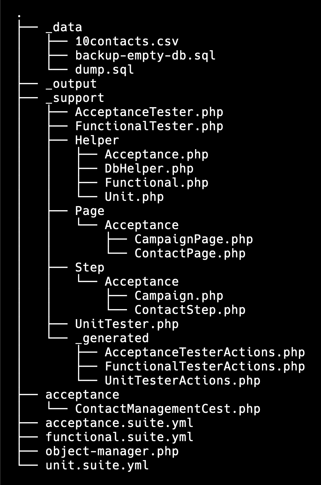

End to end test suite
#####################

This test suite ensures that new pull requests don't break any features in Mautic and helps maintain the overall quality of the app. It uses Codeception, a popular PHP testing framework, and Selenium for browser automation.

Setup
******

This guide assumes that your Mautic project is already installed and running on DDEV. If not, follow these steps:

1. Clone the repository:

.. code-block:: bash

    git clone <repository-url>
    cd <repository-name>

2. Start DDEV:

Ensure you have installed DDEV on your system. Start the DDEV environment with:

.. code-block:: bash

    ddev start

For detailed steps, refer to the Mautic documentation.

3. Build the test dependencies:

.. code-block:: bash

    bin/codecept build

The ``codeception.yml`` and ``tests/acceptance.suite.yml`` configurations are already in place.

Configuring the test environment
*********************************

In acceptance tests, your tests interact with the app through a web server, using the same database as the app. To avoid modifying the actual app database during tests, you should configure a separate test database. This setup ensures that the test environment doesn't affect your production data and allows for isolated testing.

Whenever you need to run the tests, make sure to update ``.env.local`` to enable test mode.

1. Edit .env.local:

Set the environment to test mode.

.. code-block:: bash

    # .env.local
    APP_ENV=test
    APP_DEBUG=1

2. Configure Test Database Credentials:

Ensure that your ``.env.test.local`` file contains the correct credentials for the test database.

.. code-block:: bash

    # .env.test.local
    DB_HOST=db
    DB_USER=db
    DB_PASSWD=db
    DB_NAME=test

Mautic uses the ``db`` database for production and ``test`` database for running tests.

Acceptance tests structure
**************************

The directory tests/ contains all tests, with ``codeception.yml`` in the root directory. The tests use WebDriver and Db modules, with configurations specified in ``acceptance.suite.yml``.
Codeception runs the tests in real browsers using the W3C WebDriver protocol, with Selenium managing browser interactions.

Here’s an overview of tests directory structure:

.. list-table::
   :header-rows: 1

   * - Directory
     - Description
   * - ``_data/``
     - Contains fixture data used in tests, including SQL dump files and sample CSV files.
   * - ``_output/``
     - Contains output from tests in case of failures. This includes snapshots of the browser in JPEG format and generated HTML reports for troubleshooting.
   * - ``_support/``
     - 
       - ``AcceptanceTester.php``: contains login logic that runs before each test.
       - ``Helper/``: stores custom helper functions. For example, ``DbHelper.php`` automates the process of generating SQL dump files and populating the database. It prepares the database from scratch if no dump file exists, and exports a SQL file for future use.
       - ``Page/``: stores UI locators for each page. Avoid hard-coding complex CSS or XPath locators in tests; instead, use PageObject classes.
       - ``Step/``: contains step objects that group common functionalities for tests.
   * - ``acceptance/``
     - Contains acceptance tests.

Writing and running tests
**************************

Writing tests
=============

Writing tests in Codeception involves creating files within the ``tests/Acceptance`` directory. Each file contains a class with methods that define the test scenarios.

1. Create a New Test File

Use the following command to generate a new file:

.. code-block:: bash

    bin/codecept generate:cest acceptance <TestName>

This creates a ``TestSuiteNameCest.php`` file in ``tests/Acceptance``.

2. Define Test Scenarios

Open the generated file and define your test scenarios. Each method within the class represents a different scenario. Use Codeception's built-in assertions and helper functions to verify the expected outcomes. Here’s an example:

.. code-block:: PHP

    <?php

    class TestSuiteNameCest
    {
        public function _before(AcceptanceTester $I)
        {
            // Code to run before each test
        }

        public function _after(AcceptanceTester $I)
        {
            // Code to run after each test
        }

        // Define your test methods

        public function login(AcceptanceTester $I)
        {
            $I->amOnPage('/s/login');
            $I->fillField('#username', $name);
            $I->fillField('#password', $password);
            $I->click('button[type=submit]');
            $I->see('Dashboard');
        }
    }

3. Utilize PageObjects and StepObjects

Organize your tests by using PageObject and StepObject classes. This keeps your tests clean and maintainable by separating locators and test steps into reusable components.

- Generate a page object with:

.. code-block:: bash

    bin/codecept generate:pageobject acceptance ExamplePage

This creates an ``ExamplePage.php`` file in ``/tests/Support/Page/Acceptance``.

- Generate step objects with:

.. code-block:: bash

    bin/codecept generate:stepobject acceptance Example

This creates an ``Example.php`` file in ``/tests/Support/Step/Acceptance``.

Running tests
=============

You can start tests using the ``run`` command provided by Codeception. Here are different ways to run your tests:

**Run all tests**

.. code-block:: bash

    bin/codecept run

**Run all acceptance tests**

.. code-block:: bash

    bin/codecept run acceptance

**Run a specific test file**

If you need to run a specific test file, such as ``ContactManagementCest``, use:

.. code-block:: bash

    bin/codecept run acceptance ContactManagementCest

**Run a specific test scenario**

To run a specific scenario within a test file, you can specify the test method like this:

.. code-block:: bash

    bin/codecept run acceptance ContactManagementCest:createContactFromForm

View test results
=================

After running the tests, Codeception returns the results in the terminal. Additionally, any failures generate snapshots and HTML reports in the ``_output`` directory, which you can use for debugging.

Additional options
==================

**Print steps:**

To see a step-by-step breakdown of the test execution, use:

.. code-block:: bash

    bin/codecept run acceptance ContactManagementCest --steps

**Verbose output**

For more detailed internal debug information, use:

.. code-block:: bash

    bin/codecept run acceptance ContactManagementCest -vvv

View tests in the browser
=========================

You can watch your tests run in an automated browser by visiting the following URL: ``https://mautic.ddev.site:7900/``.

``noVNC`` Access:

``Password: secret``

Contributing
************

Contributions to the test suite are welcome. Please follow the guidelines for submitting pull requests, as outlined in the :xref:`Mautic Tester Docs`.
